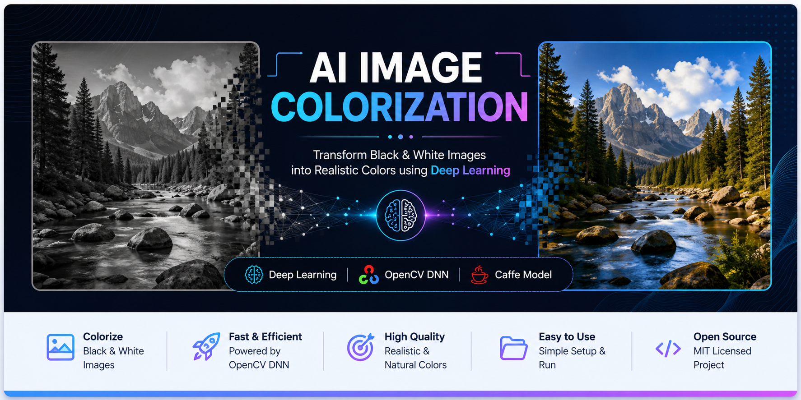
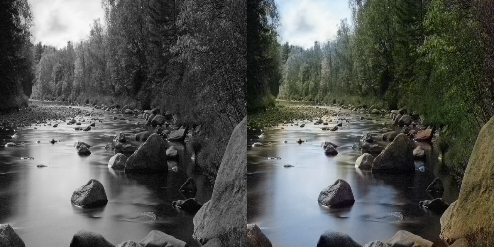

<p align="center">
  
</p>

---

<h1 align="center"> AI Image Colorization</h1>

<p align="center">
Automatically convert black & white images into realistic color images using OpenCV DNN and a pre-trained Caffe model.
</p>

<p align="center">


</p>

---

##  Preview

<p align="center">
  
</p>

<p align="center">
<b>Left:</b> Original Black & White Image &nbsp;&nbsp;&nbsp;|&nbsp;&nbsp;&nbsp;
<b>Right:</b> AI Colorized Result
</p>

---

##  About

This project demonstrates how **Deep Learning** and **Computer Vision** can be combined to automatically colorize grayscale images.

The application uses **OpenCV's Deep Neural Network (DNN)** module with a pre-trained **Caffe** model to generate realistic color information from black-and-white photographs.

---

##  Features

- Convert grayscale images into color images
- Uses a pre-trained Deep Learning model
- Built using Python and OpenCV
- Simple and beginner-friendly code
- Supports custom input images
- Easy to customize for your own images

---

##  Tech Stack

| Technology | Purpose |
|------------|---------|
| Python | Programming Language |
| OpenCV | Image Processing |
| NumPy | Numerical Computation |
| OpenCV DNN | Deep Learning Inference |
| Caffe | Pre-trained Neural Network Model |

---

##  Project Structure

```text
AI-Image-Colorization/
│
├── images/
├── Model/
│   └── README.md
├── results/
├── main.py
├── requirements.txt
├── README.md
└── LICENSE
```

---

##  Installation

### 1. Clone the repository

```bash
git clone https://github.com/Imran-pro99/AI-Image-Colorization.git
```

### 2. Move into the project folder

```bash
cd AI-Image-Colorization
```

### 3. Install dependencies

```bash
pip install -r requirements.txt
```

##  Download the Model

The pre-trained model files are **not included** in this repository.

Please follow the instructions inside:

```
Model/README.md
```

Download the required files and place them inside the **Model/** directory before running the application.

---

##  Usage

Run the project:

```bash
python main.py
```

---

##  Model Credits

This project uses a **pre-trained image colorization model** developed by:

Richard Zhang  
Phillip Isola  
Alexei A. Efros

Paper:

**Colorful Image Colorization (ECCV 2016)**

Official Repository:

https://github.com/richzhang/colorization

---

##  Future Improvements

-  Web interface using Flask
-  React frontend
-  Batch image processing
-  Drag & Drop image upload
-  Cloud deployment
-  Video colorization support

---

##  Author

**Imran Farhat**

GitHub:
https://github.com/Imran-pro99

---

##  Support

If you found this project helpful, consider giving it a ⭐ on GitHub.
